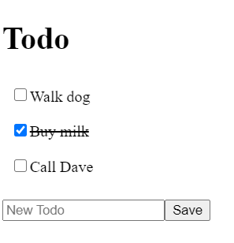

# React Todo App Part 1

## Objectives

- Compose atomic components together into more complex components
- Test components

## The Task #1

**Build a Todo App**

- Use the starter app `react-todo`
- Create a component to render a single todo i.e. `TodoItem`
    - Make it render html from data in the props
- Create a list component to render all todos i.e. `ListTodos`
    - Send it data via props
    - From it's props have it render more than one todo item
- Test your todo component

### Hints and Tips

- Use `<ul>` tags for your list of todos
- Use `<li>` tags for your todo items
- If you use a class called "complete" in your todo component, then the CSS already provided in `src/App.css` will ensure it appears struck-through when checked

## Running the solution

A possible solution is located in `./solutions/react-todo`
