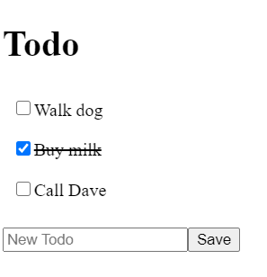

# React Todo App Part 2

## Objectives

- Working with `useState` to get and set state
- Learn how to map state to props
- Learn how to update state via functions passed as props to child components
- Learn where to put state in the component tree

## The Task #2

Continue from the previous session `./exercises/react-todo/README.md`

**Build a Todo App**

Either continue your `react-todo` app from the previous session, or start from the solution in `./solutions/react-todo` as a blank slate

Read all the steps out before starting :-)

- Refactor your code to use state to store the todos
    - Import `useState`
    - Use the todos array as the default state in a new `useState` call
    - Ensure the data passed down to the child components comes from state (not the hard-coded array)
    - Check everything works
- Create a new component to add a single todo to the todo list (without modifying the original state)
    - Add an `<input/>` element that is controlled, as per the slide deck
        - i.e. it can have it's own local state
    - Check it works (you can type in it and as you do the state is saved)
    - Create an "Add Todo" button
    - Give it a click handler
    - Make the add-button click handler add a new todo into the App state - make sure this is a copy of the state

Extra tasks:

- _Bonus_: Add delete functionality to remove a todo
- _Stretch_: Add update todo functionality to change the name of the todo
- _Stretch_: Style with CSS

## Running the solution

The solution is located in `./solutions/react-todo-continued`
