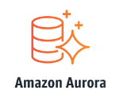
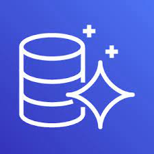
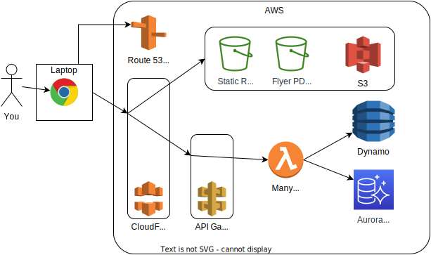
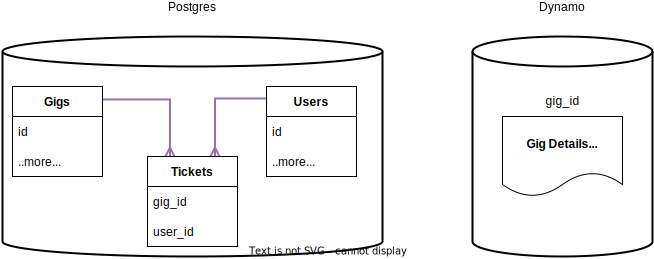
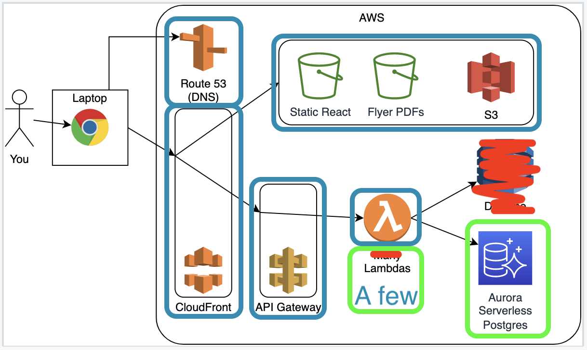
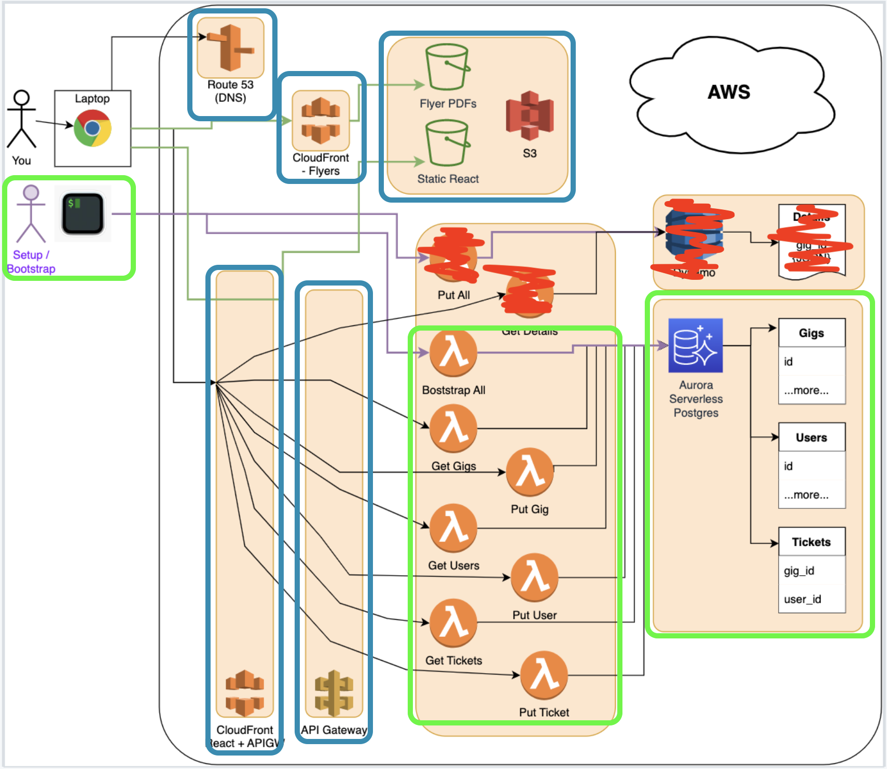
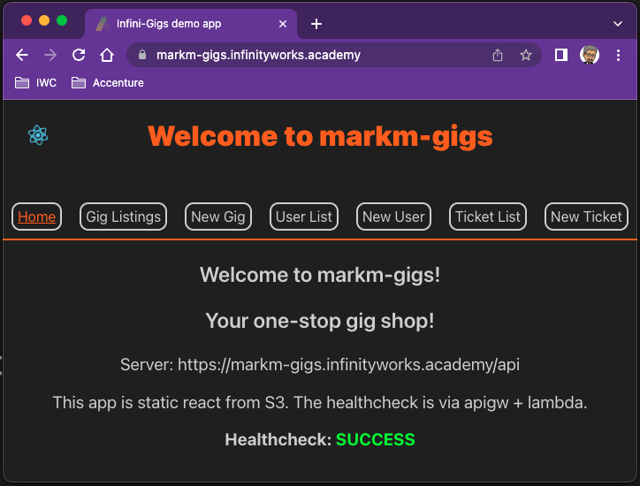

# AWS Aurora Serverless with CDK

Hosting a database

<aside class="notes">
    N/A
</aside>

---

## Overview

- What is Aurora
- Aurora Serverless vs Managed
- Hosting a (Postgres) database
- Bootstrapping a DB
- Accessing with Lambdas

<aside class="notes">
    N/A
</aside>

---

## Objectives

- Understand what Aurora Serverless does for us
- Learn the db construct
- Running SQL from Lambdas
- Invoking the Bootstrap Lambda
- Making list (get) and post (create) sql run in Lambdas

<aside class="notes">
    N/A
</aside>

---

### AWS sessions list

- AWS + Cloud intro 01 ✅ _1.5hrs_
- AWS + Cloud intro 02 ✅ _1.5hrs_
- AWS 01 S3 - storage (manual) ✅ _1.5hrs_
- AWS 02 CDK intro - with S3 ✅ _3.0hrs_
- AWS 03 Cloudfront - get files out of s3 ✅ _1.5hrs_
- AWS 04 Lambda - running code ✅ _3.0hrs_
- AWS 05 Api Gateway - put an API in front of Lambda ✅ _3.0hrs_
- AWS 06 Aurora Serverless Postgres - relational db ⬅ _3.0hrs_
- AWS 07 DynamoDB - non-relational db _3.0hrs_

<aside class="notes">
    N/A
</aside>

---

### What is Aurora?

Aurora is AWS's engine for running relational Databases.

It supports MySQL and Postgres.



<aside class="notes">
    See also https://aws.amazon.com/rds/aurora/#
</aside>

---

### What is Aurora?

A DB engine that has:

- Postgres or MySQL backends
- A _cluster_ that can have many _databases_ in it
- Continuous and/or Daily backups
- Choice of VM (EC2) sizes for compute
- Up to 15 read replicas per cluster
- Automated multi-region replication at low latency
- Distributed storage (helps durability and fast recovery)
- Autoscaling of instances and nodes for performance vs cost saving
- Security integrations with the rest of AWS

<aside class="notes">
    Go over some of the details here, like master/slaves, read-only nodes (read replicas), autoscaling up for performance and down to save costs.

    See also https://aws.amazon.com/rds/aurora/#
</aside>

---

### What is Aurora?

Using Aurora we have to manage our own virtual machines in EC2.

We can set the size and how many we want, and set autoscaling rules to make the cluster bigger when busy (for performance) and smaller when quiet (to save costs).

But what if we don't want to manage that any more than we would the compute for our lambdas (which is to say - not at all)?

<aside class="notes">
    N/A
</aside>

---

### What is Aurora Serverless?

Via [AWS](https://aws.amazon.com/rds/aurora/serverless/): "an on-demand, autoscaling configuration for Amazon Aurora"



<aside class="notes">
    From https://aws.amazon.com/rds/aurora/serverless/
</aside>

---

### What is Aurora Serverless?

It...

- Scales up and down quickly based on demand
- Can "sleep" when not used, saving cost but needing a cold-start
- Capacity (compute units) does not need to be managed but you can set upper and lower limits
- Pay per second of usage and for the amount of data transferred and stored
- Globally available
- Multi AZ deployments
- Can have read replicas set as well

<aside class="notes">
    N/A
</aside>

---

### Is Aurora Serverless?

It...

- Isn't _truly_ serverless, like Lambda and DynamoDB are
- as it has a minimum scale above zero - of 0.5 Aurora capacity units (ACUs)
- so it's never really _off_
- ...and thus has a minimum cost of at least $50/month
- ...which is not a lot on a big system, but is a lot for a small one

<aside class="notes">
    This matters a lot of every Project team has an Aurora DB!

    See also https://docs.aws.amazon.com/AmazonRDS/latest/AuroraUserGuide/aurora-serverless-v2.html
</aside>

---

### Primary use cases

These of course may overlap with "regular" Aurora, depending on your needs, but are:

- Variable workloads (sometimes high, sometimes low)
- Unpredictable workloads (patterns of usage are hard to predict)
- Cost savings when not in use (even more so than Aurora)

<aside class="notes">
  See also https://aws.amazon.com/rds/aurora/serverless/ -> "Use cases"
</aside>

---

### Serverless FTW

> Unless we have a specific need for the more traditional compute management offered by Aurora, as is the movement across a lot of "Cloud" usage now, it is sensible to start off with the lowest-effort management and go "as serverless as possible" off the bat.

<aside class="notes">
    N/A
</aside>

---

### InfiniGigs revisited

In the InfiniGigs app we have a database holding our gigs data:



This allows us to have persistent data over time.

<aside class="notes">
    Discuss with the class before going to the next slide
</aside>

---

### InfiniGigs revisited

In more detail that is:


<aside class="notes">
    Discuss with the class before going to the next slide
</aside>

---

### Infini Gigs schema

In the full app the full schema is three tables: `Gigs`, `Users` and a `Tickets` mapping table between them:



We'll only do the first "Users" table this session.

<aside class="notes">
    Discuss with the class before going to the next slide
</aside>

---

### InfiniGigs revisited

In this session we are going to look only at Postgres:



But... to do that we will need to practice running some SQL on the DB so we can create tables and insert data. And get the data out again. So the shells of the lambdas are our starting point.

<aside class="notes">
    So the shells of the lambdas are our starting point - we will fill in the sql they need to run.
</aside>

---

### InfiniGigs revisited

In more detail that is:



<aside class="notes">
    N/A
</aside>

---

### Emoji Check:

On a high level, understand that we are about to put the relational storage into our system?

1. 😢 Haven't a clue, please help!
2. 🙁 I'm starting to get it but need to go over some of it please
3. 😐 Ok. With a bit of help and practice, yes
4. 🙂 Yes, with team collaboration could try it
5. 😀 Yes, enough to start working on it collaboratively

<aside class="notes">
    The phrasing is such that all answers invite collaborative effort, none require solo knowledge.

    The 1-5 are looking at (a) understanding of content and (b) readiness to practice the thing being covered, so:

    1. 😢 Haven't a clue what's being discussed, so I certainly can't start practising it (play MC Hammer song)
    2. 🙁 I'm starting to get it but need more clarity before I'm ready to begin practising it with others
    3. 😐 I understand enough to begin practising it with others in a really basic way
    4. 🙂 I understand a majority of what's being discussed, and I feel ready to practice this with others and begin to deepen the practice
    5. 😀 I understand all (or at the majority) of what's being discussed, and I feel ready to practice this in depth with others and explore more advanced areas of the content
</aside>

---

### Code Along - InfiniGigs files!

Download and extract _this_ sessions `./exercises` zip.

> Make sure it's the `aws-iac-06-cdk-aurora-serverless` zip file!

<aside class="notes">
    Check everyone has this!
</aside>

---

### Code along - folder check!

Open a terminal in the extracted `./exercises` folder for this session:

- Run `pwd`
    - you should see the right `aws-iac-06-cdk-aurora-serverless/exercises` folder path
- Run `ls -la`
    - You should see the `gig-flyers`, `client` and `cdk` folders

Now open that same set of files in VS Code.

<aside class="notes">
    Check everyone has this!

    Get folks to shut all old VS Code windows and terminals.
</aside>

---

### Code Along - Check your env vars

Run the following in your terminal:

```bash
echo $GIGS_STACK_NAME
```

And make sure it gives you some output.

Speak now if it does not - we need this!

<aside class="notes">
    Check everyone has this
</aside>

---

### Code along - install packages

In the terminal in the `./exercises` folder for this session:

Run `./install.sh`
This will run npm i in the following locations:

- client
- cdk
- cdk/functions

<aside class="notes">
  N/A
</aside>

---

### Code along - install packages

In the terminal in the `./exercises` folder for this session:

Run `./install.sh`
This will run npm i in the following locations:

- client
- cdk
- cdk/functions

<aside class="notes">
  N/A
</aside>

---

### Code along - Verify env vars

Run the following and check that all commands return you a value:

```sh
echo $GIGS_STACK_NAME
echo $GIGS_DOMAIN
echo $AWS_PROFILE
```

You should see something like this (the names may vary for each course):

```sh
markm-gigs
somedomain.academy
academy-aws-ngei
```

<aside class="notes">
    Make sure that all learners see an output for each variable
</aside>

---

### Code Along - Build react

Let's build our react application so it's up to date and has our `GIGS_STACK_NAME` in it:

```sh
cd client
chmod a+x build.sh
./build.sh
```

This version has lots of the UI in it, ready and waiting for us to wire in the API!

<aside class="notes">
    So "VITE_STACK_NAME" etc is used in the client code - we have skirted over this until this session

    The build script sorts out our environment variables for us and runs npm install and npm run build
</aside>

---

### Code Along - initial deploy

To get everyone's stacks to the same starting point let's deploy now from the `./exercises/cdk` folder:

```sh
cd cdk # if you're not there already
aws-logon # or use the full version
npx cdk deploy
```

<aside class="notes">
    Check everyone has done this
</aside>

---

### Lets check it!

Browse to your UI on the homepage... You should see a UI up with 6 data tabs (gigs, users, tickets, with a list and new tab for each), and a happy healthcheck?



<aside class="notes">
    Verify everyone has done this
</aside>

---

### Emoji Check:

Did everyone get a UI up with 6 data tabs (gigs, users, tickets, list and new tab for each) and a _happy_ healthcheck?

1. 😢 Haven't a clue, please help!
2. 🙁 I'm starting to get it but need to go over some of it please
3. 😐 Ok. With a bit of help and practice, yes
4. 🙂 Yes, with team collaboration could try it
5. 😀 Yes, enough to start working on it collaboratively

<aside class="notes">
    The phrasing is such that all answers invite collaborative effort, none require solo knowledge.

    The 1-5 are looking at (a) understanding of content and (b) readiness to practice the thing being covered, so:

    1. 😢 Haven't a clue what's being discussed, so I certainly can't start practising it (play MC Hammer song)
    2. 🙁 I'm starting to get it but need more clarity before I'm ready to begin practising it with others
    3. 😐 I understand enough to begin practising it with others in a really basic way
    4. 🙂 I understand a majority of what's being discussed, and I feel ready to practice this with others and begin to deepen the practice
    5. 😀 I understand all (or at the majority) of what's being discussed, and I feel ready to practice this in depth with others and explore more advanced areas of the content
</aside>

---

### Quick tour

Let’s have a quick look at what we have given you so we know what we are working with.

In particular, there are:

- lambdas pre-defined
- the db utils the lambdas call are empty / to-do
- a predefined bootstrap lambda (also to-do)
- no CDK constructs yet for Aurora

> The instructor will show you the skeleton code

<aside class="notes">
    The aim here is to get them to do mainly DB related work, so all of this is prepared in advance with them only needing to think about connecting to the DB and using its syntax
</aside>

---

### Code along - Boilerplate time

We need a couple more settings to configure the new things in our stack - add these in the `./exercises/cdk/bin/cdk.ts` files in the `settings` object.

Find where it has `// TODO - add more` and replace it with this:

```ts
  dbName: 'dev', // used in the cluster and lambdas
  vpcName: 'NjaSharedVpc', // can't use importValue for vpcs
```

<aside class="notes">
    You can't use CF "cdk.Fn.importValue()" for VPC names as they are too fundamental to the CF templating, so we have to specify it.

    We can set the default database name to reflect our use (here, "dev" for development, but could as well be "infini-gigs" or "marks-gigs")
</aside>

---

### Code along - Boilerplate time

We need to match those properties in our `GigsSettings` definition in `./exercises/cdk/lib/cdk-stack.ts`.

Find where it has `// TODO - add more` and replace it with this:

```ts
  dbName: string, // new
  vpcName: string, // new
```

<aside class="notes">
    N/A
</aside>

---

### Code along - imports

We need two new parts of AWS in this session - EC2 to get to some Virtual Private Cloud networking (VPC), and RDS (Relational Database Service).

Add this at the top of the `./exercises/cdk/lib/cdk-stack.ts` file:

```ts
import * as ec2 from 'aws-cdk-lib/aws-ec2'
import * as rds from 'aws-cdk-lib/aws-rds'
```

We will look up some networking, and put the database cluster in it, so that our Lambdas can get a connection later.

<aside class="notes">
    EC2 = Elastic Compute v2
</aside>

---

### Code along - networking

We need to look up a part of our networking so we can put the DB cluster in it.

Find this bit:

```ts
// Networking lookup
// TODO
```

_More on next slide_

<aside class="notes">
    N/A
</aside>

---

### Code along - networking

We need to look up a part of our networking so we can put the DB cluster in it

```ts
// Lookup shared vpc to put db in, so other things can find it
// You can't use any tokens for Vpc.fromLookup() parameters :-(
const sharedVpc = ec2.Vpc.fromLookup(this, 'vpc', {
  vpcName: props.vpcName,
  region: props.env!.region,
})
```

This is bound to our default region.

<aside class="notes">
    N/A
</aside>

---

### Code along - add db cluster

We need to put the cluster in before the lambdas that we will attach to it.

Find this bit:

```ts
// Db Cluster
// TODO
```

_More on next slide_

<aside class="notes">
    N/A
</aside>

---

### Code along - add db cluster

Add the cluster construct after the VPC lookup:

```ts
// database goes in the vpc so other stuff can find it
const cluster = new rds.ServerlessCluster(this, 'rds-cluster',
  {
    engine: rds.DatabaseClusterEngine.auroraPostgres({
        version: rds.AuroraPostgresEngineVersion.VER_13_7}),
    parameterGroup: rds.ParameterGroup.fromParameterGroupName(
      this,
      'ParameterGroup',
      'default.aurora-postgresql13'
    ),
    defaultDatabaseName: props.dbName, // name of the DB
    vpc: sharedVpc,
    scaling: { autoPause: cdk.Duration.minutes(10) },
    removalPolicy: cdk.RemovalPolicy.DESTROY,
  }
)
```

<aside class="notes">
    Details on the next slide
</aside>

---

### What have we configured?

Technically, we have made a _cluster_ that can hold many _databases_. We only need one DB, the default one.

Those settings are:

- `engine` - we want Postgres
- `parameterGroup` - default configs for Postgres
- `defaultDatabaseName` - name of the db so we can pass it to other things
- `vpc` - where the networking will live
- `scaling` - go to sleep if not used for 10 mins
- `removalPolicy` - delete this when the stack is deleted. You can turn this off to protect data, but we don't need to this session.

<aside class="notes">
    parameterGroup - this is some default big list of db configs

    sharedVpc - our lambdas need to know where to find it - but not directly
</aside>

---

### Code along - lambda env vars

The lambdas all need to know how to find the database. We have env vars for them all to use for this.

Find this bit:

```ts
const lambdaEnvVars = {
  NODE_ENV: 'production',
  // AWS specific var to reuse TCP connection
  AWS_NODEJS_CONNECTION_REUSE_ENABLED: '1',
  // TODO - add more
}
```

_More on next slide_

<aside class="notes">
    N/A
</aside>

---

### Code along - lambda env vars

Add these:

```ts
const lambdaEnvVars = {
  // -- other settings plus -- //
  DB_NAME: props.dbName, // Same as in cluster above
  CLUSTER_ARN: cluster.clusterArn,
  SECRET_ARN: cluster.secret?.secretArn || 'NOT_SET',
}
```

Our cluster automatically creates a secret with the password in it - this maps the ARN of the secret to our lambda env for use later.

<aside class="notes">
    We put in the "NOT_SET" so we see that in the logs if something fails.
</aside>

---

### Code along - lambda permissions

The lambdas all need permission to access the database via a service called the _(Aurora) Data API_.

Find this bit:

```ts
// Grant lambda security access to database
// TODO
```

_More on next slide_

<aside class="notes">
    N/A
</aside>

---

### Code along - lambda permissions

Add the permissions we need to use the Data API on the DB:

```ts
// Grant lambda security access to database
cluster.grantDataApiAccess(bootstrapLambda)
cluster.grantDataApiAccess(getGigsLambda)
cluster.grantDataApiAccess(postGigLambda)
cluster.grantDataApiAccess(getUsersLambda)
cluster.grantDataApiAccess(postUserLambda)
cluster.grantDataApiAccess(getTicketsLambda)
cluster.grantDataApiAccess(postTicketLambda)
```

<aside class="notes">
    N/A
</aside>

---

### Code along - create!

Now from our `./exercises/cdk` folder we can deploy:

```sh
aws-logon # or use the full version
npx cdk deploy
```

_Check you are in the right folder!_

<aside class="notes">
    Make sure everyone has done this!
</aside>

---

### Emoji Check:

Did everyone get a cluster built? Say so if not!

1. 😢 Haven't a clue, please help!
2. 🙁 I'm starting to get it but need to go over some of it please
3. 😐 Ok. With a bit of help and practice, yes
4. 🙂 Yes, with team collaboration could try it
5. 😀 Yes, enough to start working on it collaboratively

<aside class="notes">
    The phrasing is such that all answers invite collaborative effort, none require solo knowledge.

    The 1-5 are looking at (a) understanding of content and (b) readiness to practice the thing being covered, so:

    1. 😢 Haven't a clue what's being discussed, so I certainly can't start practising it (play MC Hammer song)
    2. 🙁 I'm starting to get it but need more clarity before I'm ready to begin practising it with others
    3. 😐 I understand enough to begin practising it with others in a really basic way
    4. 🙂 I understand a majority of what's being discussed, and I feel ready to practice this with others and begin to deepen the practice
    5. 😀 I understand all (or at the majority) of what's being discussed, and I feel ready to practice this in depth with others and explore more advanced areas of the content
</aside>

---

### Passing DB name to the lambdas

Now we have a Cluster deployed, it has a default database in it.

From our `settings` in `./exercises/cdk/bin/cdk.ts` this is:

```ts
   dbName: 'dev'
```

This is passed into each lambda via the env vars in `lambdaEnvVars` in the stack file, so we can use it in the connection we make.

See `./exercises/cdk/lib/cdk-stack.ts`, the setup of `lambdaEnvVars`, and how it is passed to all the lambdas i.e. `gigsGetHandler`.

<aside class="notes">
    Demo this to everyone
</aside>

---

### Passing the DB connection details to the lambdas

The connection using the `data-api-client` library has been set up for us.

Each lambda's code is defined in file `./exercises/cdk/functions/aurora-lambdas.ts`. All of these use db functions in `./exercises/cdk/functions/db.ts`

At the top of `db.ts`, the connection is created using the aforementioned env vars:

```ts
import client from 'data-api-client'
const connection = client({
  secretArn: process.env.SECRET_ARN || 'NOT_SET',
  resourceArn: process.env.CLUSTER_ARN || 'NOT_SET',
  database: process.env.DB_NAME || 'NOT_SET',
})
```

<aside class="notes">
    Demo this to everyone
</aside>

---

### Defining the DB

A common starting point is to have a script (or in our case, lambda function) that sets up the tables and default data we want.

As systems get more complex, upgrading the db with more tables and keeping the data up to date can get increasingly tricky - but we don't have this problem today!

For our purposes, we have already worked out the SQL needed for these tables and some data.

The file `./exercises/cdk/functions/db-bootstrap-sqls.ts` has all these in it.

<aside class="notes">
    Demo this file
</aside>

---

### Running SQL

The syntax for using this connection library is as follows:

```ts
const createSql = 'CREATE TABLE gigs ......;'
await connection.query(createSql)

const insertSql = 'INSERT INTO gigs ......;'
await connection.query(insertSql)
```

To bootstrap our database, this is enough, as we usually don't need the return result of the `connection.query()`- if it fails an error will be thrown.

<aside class="notes">
    Technically the ";" aren't required here in the SQLs but it's really useful/good practice to always put them in.
</aside>

---

### Breakout - bootstrap the DB - 15 mins

- Find the `bootstrap` function in `functions/db.ts`
- Have it run all the imported SQL statements in order
    - i.e. `sql00_dropAllTables` through `sql06_populateTicketsTable`
- Make it return `201` when done (for the http code, an integer not a string)
- Log into AWS
- Re-deploy your stack
- Invoke your `bootstrap` lambda
    - You can invoke the lambda in the web console
    - Or by using the `./exercises/cdk/invoke-bootstrap.sh` file
- Check the logs in CloudWatch

<aside class="notes">
    Show everyone the `./exercises/cdk/invoke-bootstrap.sh` file
</aside>

---

### Emoji Check:

Did you get the `bootstrap` deployed? And, did the SQL run?

1. 😢 Haven't a clue, please help!
2. 🙁 I'm starting to get it but need to go over some of it please
3. 😐 Ok. With a bit of help and practice, yes
4. 🙂 Yes, with team collaboration could try it
5. 😀 Yes, enough to start working on it collaboratively

<aside class="notes">
    The phrasing is such that all answers invite collaborative effort, none require solo knowledge.

    The 1-5 are looking at (a) understanding of content and (b) readiness to practice the thing being covered, so:

    1. 😢 Haven't a clue what's being discussed, so I certainly can't start practising it (play MC Hammer song)
    2. 🙁 I'm starting to get it but need more clarity before I'm ready to begin practising it with others
    3. 😐 I understand enough to begin practising it with others in a really basic way
    4. 🙂 I understand a majority of what's being discussed, and I feel ready to practice this with others and begin to deepen the practice
    5. 😀 I understand all (or at the majority) of what's being discussed, and I feel ready to practice this in depth with others and explore more advanced areas of the content
</aside>

---

### Question - no bootstrap API?

> Why would we _not_ put the Bootstrap lambda in the API to let us easily invoke it?

<span>This is hopefully a one-time operation</span><!-- .element: class="fragment" -->

<span>Unless the tools we are creating is a DB Admin tool, we don't want this invoked outside our pipelines!</span><!-- .element: class="fragment" -->

<aside class="notes">
    N/A
</aside>

---

### Test your UI

> You should find the healthcheck works, but... the list tabs are still all empty?

We have data in the database now - but need to fill in the code to get it out!

We can fix that next :-)

<aside class="notes">
    N/A
</aside>

---

### Running SELECT SQLs

If we want to get the rows back from a table, we can use this:

```ts
const someSql = 'SELECT * FROM gigs ORDER BY id asc;'
const result = await connection.query(someSql)
console.log('getGigs result: ', result.records)
return result.records
```

<aside class="notes">
    This is it without parameters - we'll show that later.
</aside>

---

### Running SELECT SQLs

Consideration: For the `ORDER BY` clause on the previous slide, note that every table has different column names, not all have one called `id`.

We use `await connection.query()` on each sql use so that it is blocking (and not asynchronous).

Also, we need to return `result.records` - there is metadata in the `result` object, but we just want the rows.

<aside class="notes">
    N/A
</aside>

---

### Breakout - get data from the DB - 15 mins

Using the previous two slides:

- Keep the existing `console.log()`s so you know when functions are called
- Find the `getGigs` function in `functions/db.ts`
    - Make it run a select statement on the `gigs` table
- Find the `getUsers` function in `functions/db.ts`
    - Make it run a select statement on the `users` table
- Find the `getTickets` function in `functions/db.ts`
    - Make it run a select statement on the `tickets` table
    - Double-check the columns for the `ORDER BY` clause!
- Re-deploy the stack
- Test the "xyz List" tabs in your UI

<aside class="notes">
    Hints: Make sure you "await connection.query()" on each sql use, and console.logs are your friend!

    Check how everyone did after.
</aside>

---

### Emoji Check:

Did you get the `SELECT` code deployed? And, did the SQLs all run?

1. 😢 Haven't a clue, please help!
2. 🙁 I'm starting to get it but need to go over some of it please
3. 😐 Ok. With a bit of help and practice, yes
4. 🙂 Yes, with team collaboration could try it
5. 😀 Yes, enough to start working on it collaboratively

<aside class="notes">
    The phrasing is such that all answers invite collaborative effort, none require solo knowledge.

    The 1-5 are looking at (a) understanding of content and (b) readiness to practice the thing being covered, so:

    1. 😢 Haven't a clue what's being discussed, so I certainly can't start practising it (play MC Hammer song)
    2. 🙁 I'm starting to get it but need more clarity before I'm ready to begin practising it with others
    3. 😐 I understand enough to begin practising it with others in a really basic way
    4. 🙂 I understand a majority of what's being discussed, and I feel ready to practice this with others and begin to deepen the practice
    5. 😀 I understand all (or at the majority) of what's being discussed, and I feel ready to practice this in depth with others and explore more advanced areas of the content
</aside>

---

### Running INSERT SQLs

Next we want to INSERT some data that the client react code sends us.

In the skeleton code in the `aurora-lambdas.ts` file, each `postXYZ` lambda:

- looks at the `event.body`,
- makes it into an json object,
- and passes it on to the relevant `db.ts` function.

<aside class="notes">
    Demo this to the learners.

    More on next slide
</aside>

---

### The post-data wrapper lambdas

```ts
// POST-ed in from the react client:
userData = { user_name: 'Alice', user_address: 'Edinburgh' }
```

Then in the lambda code (abbreviated):

```ts
const usersPostHandler = async function (event: LambdaEvent) {
  console.log('POST /api/users called with', event.body)
  const dataObject = JSON.parse(event.body)
  const postResponse = await postUser(dataObject)
  return responseToApiGw(200, postResponse)
}
```

<aside class="notes">
    This is the wrapper lambda code. Describe what it's doing to the learners.

    Demo the code in 'aurora-lambdas.ts' to the learners.
</aside>

---

### Running INSERT SQLs

Having the wrapper lambdas allows us to then call out to database functions that are only concerned with a data object and SQL:

```ts
const postUser = async (userData: any) => {
  const result = await connection.query(
    'INSERT INTO users (user_name, user_address) '
      + ' VALUES (:user_name, :user_address) RETURNING *;',
    { ...userData }
  )
  return result.records
}
```

We also want to return the inserted rows, so we add `RETURNING *` on the end.

_Note how the syntax differs on this library vs the `pg` one we used in the `Databases` session. The `pg` library uses an array of parameters, this one uses named keys on an object._

<aside class="notes">
    This shows using this db library with parameters.
</aside>

---

### Breakout - insert data into the DB - 15 mins

- Find the `postGig` function in `functions/db.ts`
    - Make it run an insert statement on the `gigs` table
    - Make it return `result.records`
- Re-deploy the stack
- Test the "New Gig" tabs in the UI

Then, if you have time, do the next two, re-deploy, and re-test:

- Find the `postUser` function in `functions/db.ts`
    - Make it run an insert statement on the `users` table
    - Make it return `result.records`
- Find the `postTicket` function in `functions/db.ts`
    - Make it run an insert statement on the `tickets` table
    - Make it return `result.records`

<aside class="notes">
  Hints: console.logs are your friend!

  Doing the last two methods can be an offline task.
</aside>

---

### Emoji Check:

Did you get the `INSERT` code deployed? And, did the SQL run?

1. 😢 Haven't a clue, please help!
2. 🙁 I'm starting to get it but need to go over some of it please
3. 😐 Ok. With a bit of help and practice, yes
4. 🙂 Yes, with team collaboration could try it
5. 😀 Yes, enough to start working on it collaboratively

<aside class="notes">
    The phrasing is such that all answers invite collaborative effort, none require solo knowledge.

    The 1-5 are looking at (a) understanding of content and (b) readiness to practice the thing being covered, so:

    1. 😢 Haven't a clue what's being discussed, so I certainly can't start practising it (play MC Hammer song)
    2. 🙁 I'm starting to get it but need more clarity before I'm ready to begin practising it with others
    3. 😐 I understand enough to begin practising it with others in a really basic way
    4. 🙂 I understand a majority of what's being discussed, and I feel ready to practice this with others and begin to deepen the practice
    5. 😀 I understand all (or at the majority) of what's being discussed, and I feel ready to practice this in depth with others and explore more advanced areas of the content
</aside>

---

### Look what we did!


<aside class="notes">
    Give the Academites a little time to reflect on all the cool stuff they have done in this session.
</aside>

---

### More SQL than CDK?

> Hopefully, this session has felt more about the SQL than the CDK?

Once the CDK is done we could get on with "the real coding" ;-)

_Opinions may vary!_

But on serious note - once the infrastructure is in place on a production project it's usually quite stable, and we then (hopefully) spend less time standing up new infra compared to coding new features.

<aside class="notes">
  Give the Academites a little time to reflect on all the cool stuff they have done in this session.

  People who love the IaC just as much as the coding may have different opinions of course!
</aside>

---

## Overview - recap

- What is Aurora
- Aurora Serverless vs Managed
- Hosting a (Postgres) database
- Bootstrapping a DB
- Accessing with Lambdas

<aside class="notes">
    Give the Academites a little time to reflect on all the cool stuff they have done in this session.
</aside>

---

## Objectives - recap

- Understand what Aurora Serverless does for us
- Learn the db construct
- Running SQL from Lambdas
- Invoking the Bootstrap Lambda
- Making list (get) and post (create) sql run in Lambdas

<aside class="notes">
    Give the Academites a little time to reflect on all the cool stuff they have done in this session.
</aside>

---

### Emoji Check:

On a high level, do you think you understand the main concepts of this session? Say so if not!

1. 😢 Haven't a clue, please help!
2. 🙁 I'm starting to get it but need to go over some of it please
3. 😐 Ok. With a bit of help and practice, yes
4. 🙂 Yes, with team collaboration could try it
5. 😀 Yes, enough to start working on it collaboratively

<aside class="notes">
    The phrasing is such that all answers invite collaborative effort, none require solo knowledge.

    The 1-5 are looking at (a) understanding of content and (b) readiness to practice the thing being covered, so:

    1. 😢 Haven't a clue what's being discussed, so I certainly can't start practising it (play MC Hammer song)
    2. 🙁 I'm starting to get it but need more clarity before I'm ready to begin practising it with others
    3. 😐 I understand enough to begin practising it with others in a really basic way
    4. 🙂 I understand a majority of what's being discussed, and I feel ready to practice this with others and begin to deepen the practice
    5. 😀 I understand all (or at the majority) of what's being discussed, and I feel ready to practice this in depth with others and explore more advanced areas of the content
</aside>
