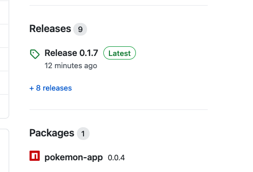

# NPM Packaging

With GitHub Actions

<aside class="notes">
SEE INSTRUCTORS README.md

The extra session [./ci-github-actions-npm-packaging.md](./ci-github-actions-npm-packaging.md) has been split out from this one.

It can be used as an advanced optional session - but the session was taking too long so we have deprecated that part.

</aside>

---

### Overview

- NPM Packaging
- Versioning

<aside class="notes">
    N/A
</aside>

---

### Objectives

- Try NPM Packaging

<aside class="notes">
    N/A
</aside>

---

### NPM Packaging

- Now we want to make NPM packages...
- We have to go over some changes for this to work.

<!-- .element: class="centered" -->

<aside class="notes">
   Show the actions that result
</aside>

---

### NPM Packaging

Two reference pages for us to go back to if it all goes wrong:

- [actions/guides/building-and-testing-nodejs](https://docs.github.com/en/actions/guides/building-and-testing-nodejs)
- [actions/guides/publishing-nodejs-packages](https://docs.github.com/en/actions/guides/publishing-nodejs-packages)

<aside class="notes">
   For reference
</aside>

---

### Demo - code changes in package.json

- Compared to the skinny `package.json` files we have used on the course so far, we need some specific updates to make sure using node/npm works nicely
- The stanzas on the following slides are already included in your sample
- However, we need per-person updates!

<aside class="notes">
   Show the sample repo `./pokemon-app/package.json` file

   Discuss each of the stanzas that follow
</aside>

---

### Demo - name in package.json

> `name` must include the organisation, and is going to be our package name too, which must be unique in the **Organisation**, and also **lower case**!

```sh
    "name": "@iw-academy/pokemon-app-your-name"
```

- If we don't do this, the package name will be of the form `organisation/repo-name`, which for this case we do not want
- Make sure yours is _unique_

<aside class="notes">
   Show the sample repo `./pokemon-app/package.json` file

   Discuss each of the stanzas above
</aside>

---

### Demo - version in package.json

> `version` must be incremented on every key update, as you can't build the same version twice

```sh
    "version": "0.0.1",
```

<aside class="notes">
   Show the sample repo `./pokemon-app/package.json` file

   Discuss each of the stanzas above
</aside>

---

### Demo - publishConfig in package.json

> `publishConfig` must point into GitHub npm packages, and to avoid a bug also specify the cache folder.

```sh
    "publishConfig": {
        "cache": "~/.npm",
        "registry": "https://npm.pkg.github.com"
    },
```

So, also check the exclusion `.npm` is in your `.gitignore` file - [see here](https://github.com/npm/cli/issues/2834)

<aside class="notes">
   Show the sample repo `./pokemon-app/package.json` file

   Discuss each of the stanzas above
</aside>

---

### Demo - repository in package.json

> `repository` must be specified, otherwise `name` is used in the format `@organisation/repo-name`, which we don't want. _We could, if we had only one app per repo and the repo name is unique_.

```sh
    "repository": {
        "type": "git",
        "url": "https://github.com/IW-Academy/academy-github-actions-demo.git"
    },
```

<aside class="notes">
   Show the sample repo `./pokemon-app/package.json` file

   Discuss each of the stanzas above
</aside>

---

### Demo - good citizenship in package.json

> Lets be good citizens a specify the other good stuff:

```sh
    "description": "Simple pokemon app for demos and use in github",
    "author": "InfinityWorks",
    "license": "MIT",
```

<aside class="notes">
   Show the sample repo `./pokemon-app/package.json` file

   Discuss each of the stanzas above
</aside>

---

### Emoji Check:

How do you feel about the progress so far?

1. 😢 Haven't a clue, please help!
2. 🙁 I'm starting to get it but need to go over some of it please
3. 😐 Ok. With a bit of help and practice, yes
4. 🙂 Yes, with team collaboration could try it
5. 😀 Yes, enough to start working on it collaboratively

<aside class="notes">
    The phrasing is such that all answers invite collaborative effort, none require solo knowledge.

    The 1-5 are looking at (a) understanding of content and (b) readiness to practice the thing being covered, so:

    1. 😢 Haven't a clue what's being discussed, so I certainly can't start practising it (play MC Hammer song)
    2. 🙁 I'm starting to get it but need more clarity before I'm ready to begin practising it with others
    3. 😐 I understand enough to begin practising it with others in a really basic way
    4. 🙂 I understand a majority of what's being discussed, and I feel ready to practice this with others and begin to deepen the practice
    5. 😀 I understand all (or at the majority) of what's being discussed, and I feel ready to practice this in depth with others and explore more advanced areas of the content
</aside>

---

### Now let's publish it

> We want to publish a new version whenever master is updated.

- The extra bit is this:

```yml
    - name: npm publish
      working-directory: ./pokemon-app
      run: npm publish --access public
      env:
        NODE_AUTH_TOKEN: ${{ secrets.GITHUB_TOKEN }}
```

<aside class="notes">
   N/A
</aside>

---

### But wait...

> Can we think of a problem with repeat pushes to main?

<span>_hint..._ `version: ???`</span><!-- .element: class="fragment" -->

<aside class="notes">
   Discuss how we'll have to manually increment VERSION all the time
</aside>

---

### Task: Add publishing

> Add file `.github/workflows/node-js-all.yml` to your repo.

- Commit and push
- Watch your actions

<aside class="notes">
   Discuss how we'll have to manually increment VERSION all the time
</aside>

---

### Task: Increment your version

> In file `pokemon-app/package.json` increment your version.

- Commit and push
- Watch your actions

<aside class="notes">
   Discuss how we'll have to manually increment VERSION all the time

   Discuss how it would be handy to set that version outside of the text files (coming in later slides)
</aside>

---

### Emoji Check:

How do you feel about the progress so far?

1. 😢 Haven't a clue, please help!
2. 🙁 I'm starting to get it but need to go over some of it please
3. 😐 Ok. With a bit of help and practice, yes
4. 🙂 Yes, with team collaboration could try it
5. 😀 Yes, enough to start working on it collaboratively

<aside class="notes">
    The phrasing is such that all answers invite collaborative effort, none require solo knowledge.

    The 1-5 are looking at (a) understanding of content and (b) readiness to practice the thing being covered, so:

    1. 😢 Haven't a clue what's being discussed, so I certainly can't start practising it (play MC Hammer song)
    2. 🙁 I'm starting to get it but need more clarity before I'm ready to begin practising it with others
    3. 😐 I understand enough to begin practising it with others in a really basic way
    4. 🙂 I understand a majority of what's being discussed, and I feel ready to practice this with others and begin to deepen the practice
    5. 😀 I understand all (or at the majority) of what's being discussed, and I feel ready to practice this in depth with others and explore more advanced areas of the content
</aside>

---

### Overview - recap

- NPM Packaging
- Versioning

<aside class="notes">
    N/A
</aside>

---

### Objectives - recap

- Try NPM Packaging

<aside class="notes">
    N/A
</aside>
