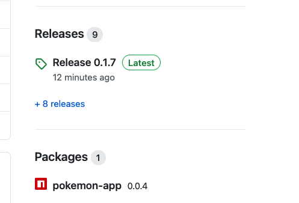

# Continuous Integration

With GitHub Actions

<aside class="notes">
    N/A
</aside>

---

### Overview

- Intro to CI/CD concepts
- What is Continuous Integration (CI)?
- What are GitHub Actions?
- CI with GitHub Actions

<aside class="notes">
    N/A
</aside>

---

### Objectives

- Intro to CI/CD concepts
- Use GitHub Actions (GitHub Actions)
- Use GitHub Actions on Push
- Use GitHub Actions on Merge
- Automatically Unit Test our code

<aside class="notes">
    N/A
</aside>

---

### Releasing Software

- Changing software
- What is CI?
- What is CD?
- The CI/CD flow
- Some CI/CD software

<aside class="notes">
    N/A
</aside>

---

### Changing software

Why does software need to change?

<span>Features</span><!-- .element: class="fragment" -->

<span>Bug fixes</span><!-- .element: class="fragment" -->

<span>Security patches</span><!-- .element: class="fragment" -->

<span>Contract changes</span><!-- .element: class="fragment" -->

<span>Performance optimisations</span><!-- .element: class="fragment" -->

<aside class="notes">
    N/A
</aside>

---

### What does software need to run?

<!-- .element: class="centered" -->

There are usually lots of dependencies we need. Do we want to set those up by hand?

<aside class="notes">
    N/A
</aside>

---

### What is an environment?

An **environment** is the place where our software runs

<span>Environments are comprised of the resources and infrastructure that support the operation of a software system</span><!-- .element: class="fragment" -->

<aside class="notes">
    N/A
</aside>

---

### Who needs access to an environment?

<span>Developers</span><!-- .element: class="fragment" -->

<span>Operations</span><!-- .element: class="fragment" -->

<span>Testers</span><!-- .element: class="fragment" -->

<span>PO</span><!-- .element: class="fragment" -->

<span>Client's support team</span><!-- .element: class="fragment" -->

<span>End users</span><!-- .element: class="fragment" -->

<aside class="notes">
note: Different needs, access product at different stages, different expectations. Next slide is environments: whiteboard it first with all the people, let them discuss
</aside>

---

### Software Lifecycle

<!-- .element: class="centered" -->

Code goes through several stages to get to our users.

<aside class="notes">
    N/A
</aside>

---

### Types of environments

The development environment is usually the first thing you set up when working on a software project

<span>Development: maximise developer productivity, usually local.</span><!-- .element: class="fragment" -->

<span>Testing: hosted, similar to customer-facing environment, for more complex integration and E2E tests.</span><!-- .element: class="fragment" -->

<span>UAT/Staging: as stable and production-like as possible, used for customer demos and wider service integration.</span><!-- .element: class="fragment" -->

<span>Production: live, end-user-facing environment. _You must protect it at all costs._</span><!-- .element: class="fragment" -->

<aside class="notes">
    N/A
</aside>

---

### Promoting software through our environments

Different people scrutinising the product at various stages reduces the risk of severe defects.

Having multiple environments helps find bugs in our software before it's released to the public.

Changes to the software require deployments up the chain, all the way to production.

<aside class="notes">
    N/A
</aside>

---

Wouldn't it be awesome if we could automate the entire software delivery process?

<aside class="notes">
    N/A
</aside>

---

### What is CI?

**Continuous Integration** (CI) works by pushing small code chunks to your application's code base hosted in a Git repository, and, for every push, run a pipeline of scripts to build, test, and validate the code changes before merging them into the main branch

<span>Bugs and regressions are minimised because they're detected early on and automatically.</span><!-- .element: class="fragment" -->

<aside class="notes">
    N/A
</aside>

---

### The objectives of CI

<span>Short feedback loops</span><!-- .element: class="fragment" -->

<span>Catch faults before they become a real issue</span><!-- .element: class="fragment" -->

<span>Consistent software quality</span><!-- .element: class="fragment" -->

<span>Augmenting team collaboration</span><!-- .element: class="fragment" -->

<span>Minimising bugs and regressions</span><!-- .element: class="fragment" -->

<aside class="notes">
    N/A
</aside>

---

### The enemies of CI

<span>Knowledge silos</span><!-- .element: class="fragment" -->

<span>Manual work</span><!-- .element: class="fragment" -->

<span>Inconsistent environments</span><!-- .element: class="fragment" -->

<span>Big PRs</span><!-- .element: class="fragment" -->

<aside class="notes">
Non-repeatable, manually set up environments, which diverge from one another. Big PRs. Knowledge silos mean no-one can encode the entire deployment process on their own, as knowledge of it is disseminated
</aside>

---

### What is CD?

**Continuous Delivery and Deployment** consists of a step further to CI, deploying your application to production at every push to main/master branches of your code repositories.

<aside class="notes">
note: These methodologies allow you to catch bugs and errors early in the development cycle, ensuring that all the code deployed to production complies with the code standards you established for your app. Big-bang releases which introduce risk and instability and make rollbacks harder
</aside>

---

### The Objectives of CD

<span>Getting new features and fixes out to end users quickly</span><!-- .element: class="fragment" -->

<span>Experimentation</span><!-- .element: class="fragment" -->

<span>Reducing risk around releases</span><!-- .element: class="fragment" -->

<span>Easier, safer rollbacks</span><!-- .element: class="fragment" -->

<aside class="notes">
    N/A
</aside>

---

### The Enemies of CD

<span>Big-bang releases</span><!-- .element: class="fragment" -->

<span>Poor task breakdown</span><!-- .element: class="fragment" -->

<span>Red tape</span><!-- .element: class="fragment" -->

<aside class="notes">
    N/A
</aside>

---

### CI/CD Pipelines

<aside class="notes">
    N/A
</aside>

---

### What is a pipeline?

> "a route, channel, or process along which something passes or is provided at a steady rate; means, system, or flow of supply or supplies"

_dictionary.com_

<aside class="notes">
    N/A
</aside>

---

### Task - invent a pipeline - 10 mins

- We will split into groups
- Whiteboard a build pipeline
    - What do you think the ideal pipeline would look like for your team projects?
    - Think about all the steps to go from a Ticket on your boards to Production in front of happy users.

<aside class="notes">
    Start a discussion around this question
</aside>

---

### Discuss - pipelines - 10 mins

- Lets discuss what each group came up with for a few mins each.

Thing to think about:

- The difference between your _daily working practices_, and what an _automated pipeline_ can do

<aside class="notes">
    Discuss the difference between (a) Your local daily workflow of doing tickets, Pull Requests, etc, and (b) what a Pipeline can do, i.e. trigger stuff on merging to Main, then run unit tests and deployments

    The Concourse tutorial https://concoursetutorial.com/ has a good pipeline animated gif on it
</aside>

---

### Stages & Environments

- **Development**: Maximises developer productivity (local)
- **QA Testing**: Similar to production, used for running various tests (integration / E2E)
- **UAT/Staging**: As production-like as possible, used for customer demos and wider service integrations
- **Production**: The live end-user-facing environment running in the real world

<aside class="notes">
    N/A
</aside>

---

<!-- .element: class="centered" -->

<aside class="notes">
    Ignore the N+ that's a reference to Nginx
</aside>

---

### Promoting Software

Software goes through various steps before it is eventually promoted to production in the bid to reduce the risk of severe defects

Some teams still require a human to allow code to ship, this is known as a gated-release.

<aside class="notes">
    N/A
</aside>

---

### There are many options

- Jenkins
- Concourse
- CircleCI
- Github Actions
- And a large _etc_.

<aside class="notes">
    We'll use Github Actions as we have GitHub repos

    https://concoursetutorial.com/
</aside>

---

### GitHub Actions

- As our code is in GitHub we'll use these

<aside class="notes">
  N/A
</aside>

---

### Task: New GitHub Repo

> Make a new GitHub repo named like "yourname-ci-cd" in the School of Tech organisation

- Include a README file, Node `.gitignore`, and a License file
- Clone it now

This repo is for use in this session and the `cd-github-actions` session.

<aside class="notes">
  Demo doing this and get everyone to follow along.
</aside>

---

### Demos and Tasks

Throughout this session:

> The instructor will show you some worked examples
>
> Then you can code along in breakouts

<aside class="notes">
  N/A
</aside>

---

### Production objectives

> Run our unit tests
> ...then...
> Build an NPM Artefact and / or Release a version of our code

Like this:

<!-- .element: class="centered" -->

<aside class="notes">
  N/A
</aside>

---

### Objective - Considerations

Typically on a production system we'd want to...

- Run our tests so we never forget (Unit, Integration, etc)
- And then make versioned _Artifacts_
- These will then either be built into Releases as zip or other files
- _Or_ published Package Versions
- _Or_ versioned containers
- etc.

_We'll just look at Unit Tests in this session_

<aside class="notes">
  N/A
</aside>

---

### Emoji Check:

How do you feel about the idea of automating out testing?

1. 😢 Haven't a clue, please help!
2. 🙁 I'm starting to get it but need to go over some of it please
3. 😐 Ok. With a bit of help and practice, yes
4. 🙂 Yes, with team collaboration could try it
5. 😀 Yes, enough to start working on it collaboratively

<aside class="notes">
    The phrasing is such that all answers invite collaborative effort, none require solo knowledge.

    The 1-5 are looking at (a) understanding of content and (b) readiness to practice the thing being covered, so:

    1. 😢 Haven't a clue what's being discussed, so I certainly can't start practising it (play MC Hammer song)
    2. 🙁 I'm starting to get it but need more clarity before I'm ready to begin practising it with others
    3. 😐 I understand enough to begin practising it with others in a really basic way
    4. 🙂 I understand a majority of what's being discussed, and I feel ready to practice this with others and begin to deepen the practice
    5. 😀 I understand all (or at the majority) of what's being discussed, and I feel ready to practice this in depth with others and explore more advanced areas of the content
</aside>

---

### Task: Copy gigs app - 5 mins

- Copy the `exercises/client` folder into the root of your `yourname-ci-cd` repo
    - I.e. you end up with a folder `./client`

<aside class="notes">
    N/A
</aside>

---

### Checkpoint!

> Where did you put that folder?

- Open a terminal in the root of your `yourname-ci-cd` github repo
- Run `ls -la`
- You should see the `client` folder (not `exercises/client`!)

Shout out if not!

<aside class="notes">
    N/A
</aside>

---

### Task: git push

- Add, commit and push your repo

<aside class="notes">
    N/A
</aside>

---

### Checkpoint!

> Have we all pushed ok?

Shout out if not!

<aside class="notes">
    N/A
</aside>

---

### Emoji Check:

Has everyone got the client into github ok?

1. 😢 Haven't a clue, please help!
2. 🙁 I'm starting to get it but need to go over some of it please
3. 😐 Ok. With a bit of help and practice, yes
4. 🙂 Yes, with team collaboration could try it
5. 😀 Yes, enough to start working on it collaboratively

<aside class="notes">
    The phrasing is such that all answers invite collaborative effort, none require solo knowledge.

    The 1-5 are looking at (a) understanding of content and (b) readiness to practice the thing being covered, so:

    1. 😢 Haven't a clue what's being discussed, so I certainly can't start practising it (play MC Hammer song)
    2. 🙁 I'm starting to get it but need more clarity before I'm ready to begin practising it with others
    3. 😐 I understand enough to begin practising it with others in a really basic way
    4. 🙂 I understand a majority of what's being discussed, and I feel ready to practice this with others and begin to deepen the practice
    5. 😀 I understand all (or at the majority) of what's being discussed, and I feel ready to practice this in depth with others and explore more advanced areas of the content
</aside>

---

### Task: Test gigs App - 2 mins

**Important:** check the comprehensive unit tests pass:

```sh
cd client
npm install
npm test
```

<aside class="notes">
  "comprehensive" being quite generous here ;-)

  We always want a valid set of code with unit tests for our actions to work on - these steps just show that this is true, just like we would want in local development.
</aside>

---

### Question

What if we make changes and forget to the run hte tests?

What if we can _also_ get GitHub to run them for us?

<aside class="notes">
  N/A
</aside>

---

### GitHub Action intro

> Now we have a a repo with some code.

- Lets add one of the starter GitHub Actions.

<aside class="notes">
   Get everyone to open the page
</aside>

---

### Task: GitHub Action intro - 10 mins

> A great start is [actions/understanding-github-actions](https://docs.github.com/en/actions/learn-github-actions/understanding-github-actions)

 Open the page up. Lets go through it as a key source of truth.

- Workflows, Events, Jobs, Actions, Runners.

<aside class="notes">
   Get everyone to open the page, talk through all the terms on it.
</aside>

---

### The task

> We will do what it says on the GitHub page - there's no point in repeating great material!
>
> Do this: https://docs.github.com/en/actions/learn-github-actions/understanding-github-actions#create-an-example-workflow

**Gotchas:**

- Start on your `main` branch
- Make sure the new folder `.github/workflows/` is in the **root** of your git repo!
- Make sure the `*.yml` file is in the `.github/workflows/` folder!

_More on next slide_

<aside class="notes">
   Read out the key points, show the sample file in https://github.com/IW-Academy/academy-github-actions-demo/blob/main/.github/workflows/learn-github-actions.yml

   Do the actions on the page, and show them in our sample repo repo [infinityworks/academy-github-actions-demo](https://github.com/IW-Academy/academy-github-actions-demo)
</aside>

---

### Task: Add file - 10 mins

- Add this file as per the GitHub instructions on your `main` branch

<!-- .element: class="centered" -->

**Gotchas:**

- Make sure the new folder `.github/workflows/` is in the root of your git repo!
- Make sure the `*.yml` file is in the `.github/workflows/` folder!

<aside class="notes">
   Show the actions that result
</aside>

---

### Demo: See your working actions

> Commit and push to your `main` branch.

> Follow along with the instructor

_Image on next slide_

<aside class="notes">
   Show the actions that result
</aside>

---

### Demo: See your working actions

<!-- .element: class="centered" -->

<aside class="notes">
   Show the actions that result
</aside>

---

### Emoji Check:

Do you on a high level understand what GitHub is now doing for us?

1. 😢 Haven't a clue, please help!
2. 🙁 I'm starting to get it but need to go over some of it please
3. 😐 Ok. With a bit of help and practice, yes
4. 🙂 Yes, with team collaboration could try it
5. 😀 Yes, enough to start working on it collaboratively

<aside class="notes">
    The phrasing is such that all answers invite collaborative effort, none require solo knowledge.

    The 1-5 are looking at (a) understanding of content and (b) readiness to practice the thing being covered, so:

    1. 😢 Haven't a clue what's being discussed, so I certainly can't start practising it (play MC Hammer song)
    2. 🙁 I'm starting to get it but need more clarity before I'm ready to begin practising it with others
    3. 😐 I understand enough to begin practising it with others in a really basic way
    4. 🙂 I understand a majority of what's being discussed, and I feel ready to practice this with others and begin to deepen the practice
    5. 😀 I understand all (or at the majority) of what's being discussed, and I feel ready to practice this in depth with others and explore more advanced areas of the content
</aside>

---

### Lets get testing!

Now we'd like GitHub to run our unit tests for us.

In production systems we'd also run builds and integration tests too!

But we'll start at the beginning, with unit tests run on all git pushes.

<aside class="notes">
   Discuss what we might want to do in a full-fat production system.
</aside>

---

### Demo - NodeJS with Github

GitHub has great docs about Node testing

> https://docs.github.com/en/actions/automating-builds-and-tests/building-and-testing-nodejs

Lets look at the elements on the [nodejs-starter-workflow](https://docs.github.com/en/actions/automating-builds-and-tests/building-and-testing-nodejs#using-the-nodejs-starter-workflow)

_More on next slide_

<aside class="notes">
   Open the web page
</aside>

---

### The GitHub docs

Key stanzas in the GitHub docs are:

- The `on:` clause for the branches and triggers
- The `jobs:/build:` clause telling us what to do
- The `node-version:`(s)
- The `steps:` clause - these should be familiar in concept (checkout, ci, build, test)

<aside class="notes">
   Talk through the sample on the page
</aside>

---

### Task - add Node testing file - 5 mins

> Copy the sample file `./exercises/.github/workflows/node-js-test.yml` to your project in the `.github/workflows/node-js-test.yml` folder

<aside class="notes">
   Check it is in the right place!

   This can be in breakouts where they check each others work
</aside>

---

### Spot the differences

_The file we copied is modified for our purposes..._ What differences can you see?

<span>On all pushes</span><!-- .element: class="fragment" -->

<span>One node version</span><!-- .element: class="fragment" -->

<span>Dependency cache</span><!-- .element: class="fragment" -->

<span>Working directories</span><!-- .element: class="fragment" -->

<span>All tasks given a separate name</span><!-- .element: class="fragment" -->

<aside class="notes">
   Discuss all the changes and what they might do
</aside>

---

### Task - activate - 10 mins

- Commit and push
- Watch your actions in the console

<aside class="notes">
   Check if everyone's is working

   This can be in breakouts where they check each others work
</aside>

---

### Emoji Check:

How do you feel about things we have asked GitHub to do?

1. 😢 Haven't a clue, please help!
2. 🙁 I'm starting to get it but need to go over some of it please
3. 😐 Ok. With a bit of help and practice, yes
4. 🙂 Yes, with team collaboration could try it
5. 😀 Yes, enough to start working on it collaboratively

<aside class="notes">
    The phrasing is such that all answers invite collaborative effort, none require solo knowledge.

    The 1-5 are looking at (a) understanding of content and (b) readiness to practice the thing being covered, so:

    1. 😢 Haven't a clue what's being discussed, so I certainly can't start practising it (play MC Hammer song)
    2. 🙁 I'm starting to get it but need more clarity before I'm ready to begin practising it with others
    3. 😐 I understand enough to begin practising it with others in a really basic way
    4. 🙂 I understand a majority of what's being discussed, and I feel ready to practice this with others and begin to deepen the practice
    5. 😀 I understand all (or at the majority) of what's being discussed, and I feel ready to practice this in depth with others and explore more advanced areas of the content
</aside>

---

### Overview - recap

- What is CI?
- Can you remember any of the objectives of CI?
- What is CD?
- And what about the objectives of CD?
- What do we mean by the term 'pipeline'?
- What are GitHub Actions?
- How can CI be implemented with GitHub Actions?

<aside class="notes">
    N/A
</aside>

---

### Objectives - recap

- Today you have had an intro to CI/CD concepts
- Used GitHub Actions
- Used GitHub Actions on Push
- Used GitHub Actions on Merge
- Automatically Unit Test our code

<aside class="notes">
    Give the Academites a little time to reflect on all the cool stuff they have done in this session.
</aside>

---

### Further thoughts

> How about adding the unit testing to your Team Projects?

<aside class="notes">
    Give the Academites a little time to reflect on all the cool stuff they have done in this session.
</aside>

---

### Emoji Check:

On a high level, do you think you understand the main concepts of this session? Say so if not!

1. 😢 Haven't a clue, please help!
2. 🙁 I'm starting to get it but need to go over some of it please
3. 😐 Ok. With a bit of help and practice, yes
4. 🙂 Yes, with team collaboration could try it
5. 😀 Yes, enough to start working on it collaboratively

<aside class="notes">
    The phrasing is such that all answers invite collaborative effort, none require solo knowledge.

    The 1-5 are looking at (a) understanding of content and (b) readiness to practice the thing being covered, so:

    1. 😢 Haven't a clue what's being discussed, so I certainly can't start practising it (play MC Hammer song)
    2. 🙁 I'm starting to get it but need more clarity before I'm ready to begin practising it with others
    3. 😐 I understand enough to begin practising it with others in a really basic way
    4. 🙂 I understand a majority of what's being discussed, and I feel ready to practice this with others and begin to deepen the practice
    5. 😀 I understand all (or at the majority) of what's being discussed, and I feel ready to practice this in depth with others and explore more advanced areas of the content
</aside>
